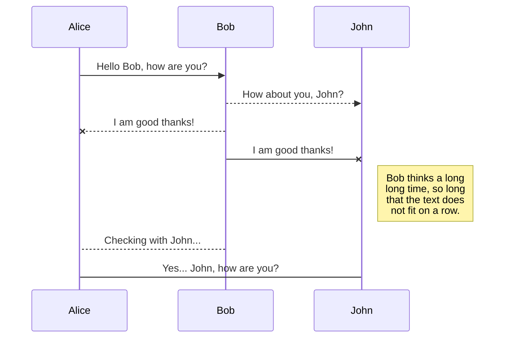
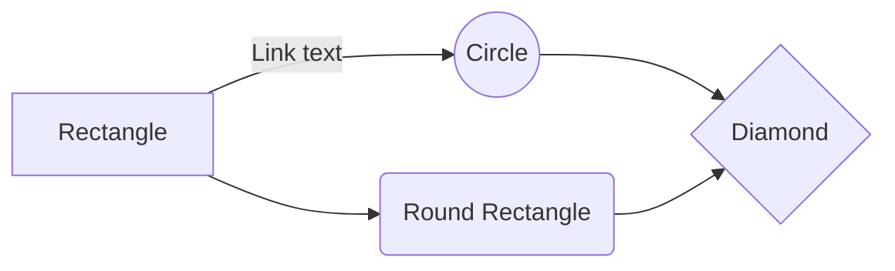

# Welcome to GitPen!

Hello! I am your first Markdown file in **GitPen**. If you want to learn about GitPen, you can read this article. If you want to play with Markdown, you can also edit this article. Additionally, you can create new files by opening the **File Explorer** on the left side of the navigation bar.

# Files

GitPen stores your files in your browser, which means all your files are automatically saved locally and can be **accessed offline!**

## Creating Files and Folders

Use the folder icon on the left side of the navigation bar to access the File Explorer. You can create a new file by clicking the **Create File** icon in the File Explorer. You can also create folders by clicking the **Create Folder** icon.

## Switching to Another File

All your files and folders are displayed as a tree in the File Explorer. You can switch from one file to another by clicking on a file in the tree.

## Renaming a File

You can rename the current file by clicking on the file name in the navigation bar or by clicking the **Rename** icon in the File Explorer.

## Searching for Files

You can search for files by keyword throughout the entire document space by clicking the **Search Files** icon in the File Explorer.

## Deleting a File

You can delete the current file by clicking the **Delete** icon in the File Explorer. The file will be moved to the **Trash** folder and automatically deleted after 7 days of inactivity.

## Exporting Files

You can export the current file by clicking **Import/Export** in the menu. You can choose to export the file as plain Markdown, HTML using Handlebars templates, or PDF.

# Synchronization

Synchronization is one of GitPen's greatest features. It allows you to sync any file in your document space with other files stored in your **Gitee** and **GitHub** accounts. This enables you to continue writing on other devices, collaborate with people you share files with, and easily integrate into your workflow... The sync mechanism triggers in the background every minute, downloading, merging, and uploading file modifications.

There are two types of synchronization that complement each other:

- Workspace sync will automatically sync all your files, folders, and settings. This will allow you to access your document space on any other device.
> To start syncing your document space, simply log in with Gitee from the menu.

- File sync will keep one file in the document space synchronized with one or more files in **Gitee** or **GitHub**.
> Before you can start syncing files, you must link an account in the **Sync** submenu.

## Opening a File

You can open a file from **Gitee** or **GitHub** by opening the **Sync** submenu and clicking **Open from...**. Once opened in the document space, any modifications to the file will be automatically synchronized.

## Saving a File

You can save any file in the document space to **Gitee** or **GitHub** by opening the **Sync** submenu and clicking **Save to...**. Even if a file in the document space is already synchronized, you can save it to another location. GitPen can sync one file with multiple locations and accounts.

## Syncing Files

Once your file is linked to a sync location, GitPen will periodically sync it by downloading/uploading any modifications. If necessary, merging will be performed and conflicts resolved.

If you have just modified a file and want to force a sync, click the **Sync Now** button in the navigation bar.

> **Note:** If you don't have any files to sync, the **Sync Now** button will be disabled.

## Managing File Synchronization

Since a file can be synchronized with multiple locations, you can list and manage sync locations by clicking **File Synchronization** in the **Sync** submenu. This allows you to list and remove sync locations linked to your file.

# Publishing

Publishing in GitPen allows you to easily publish files online. Once you're satisfied with a file, you can publish it to different hosting platforms such as **Blogger**, **Gitee**, **Gist**, **GitHub**, **WordPress**, and **Zendesk**. Using [Handlebars templates](http://handlebarsjs.com/), you have full control over the exported content.

> Before you can start publishing, you must link an account in the **Publish** submenu.

## Publishing a File

You can publish your file by opening the **Publish** submenu and clicking **Publish to**. For some locations, you can choose the following formats:

- Markdown: Publish Markdown text on websites that can interpret it (e.g., **GitHub**),
- HTML: Publish the file converted to HTML via Handlebars templates (e.g., on a blog).

## Updating a Publication

After publishing, GitPen will link your file to that publication, making it easy to republish. Once you've modified the file and want to update your publication, click the **Publish Now** button in the navigation bar.

> **Note:** If you don't have any files to publish, the **Publish Now** button will be disabled.

## Managing File Publications

Since a file can be published to multiple locations, you can list and manage publication locations by clicking **File Publications** in the **Publish** submenu. This allows you to list and remove publication locations linked to your file.

# Markdown Extensions

GitPen extends standard Markdown syntax by adding extra **Markdown Extensions**, providing you with some nice features.

> **Tip:** You can disable any **Markdown Extension** in the **File Properties** dialog.

## SmartyPants

SmartyPants converts ASCII punctuation characters into "smart" typographic punctuation HTML entities. For example:

|                  |ASCII                          |HTML                         |
|------------------|-------------------------------|-----------------------------|
|Single backticks  |`'Isn't this fun?'`            |'Isn't this fun?'            |
|Quotes            |`"Isn't this fun?"`            |"Isn't this fun?"            |
|Dashes            |`-- is en-dash, --- is em-dash`|-- is en-dash, --- is em-dash|

## KaTeX

You can render LaTeX math expressions using [KaTeX](https://khan.github.io/KaTeX/):

The *Gamma function* satisfying $\Gamma(n) = (n-1)!\quad\forall n\in\mathbb N$ is via the Euler integral

$
\Gamma(z) = \int_0^\infty t^{z-1}e^{-t}dt\,.
$

> You can find more information about **LaTeX** math expressions [here](http://meta.math.stackexchange.com/questions/5020/mathjax-basic-tutorial-and-quick-reference).

## UML Diagrams

You can render UML diagrams using [Mermaid](https://mermaidjs.github.io/). For example, this will produce a sequence diagram:

This will produce a flowchart:

