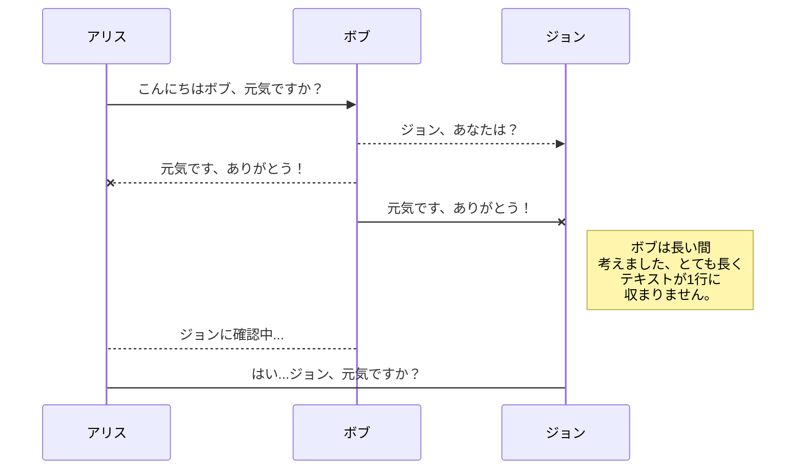
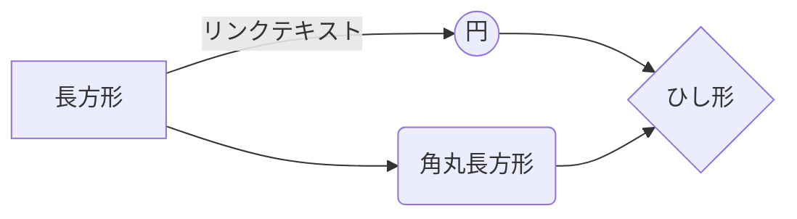

# GitPen へようこそ！

こんにちは！私は **GitPen** での最初の Markdown ファイルです。GitPen について知りたい場合は、この記事をお読みください。Markdown で遊びたい場合は、この記事を編集することもできます。また、ナビゲーションバーの左側にある**ファイルエクスプローラー**を開いて、新しいファイルを作成することもできます。

# ファイル

GitPen はファイルをブラウザに保存します。つまり、すべてのファイルは自動的にローカルに保存され、**オフラインでアクセス**できます！

## ファイルとフォルダの作成

ナビゲーションバーの左側にあるフォルダアイコンを使用して、ファイルエクスプローラーにアクセスできます。ファイルエクスプローラーの**ファイル作成**アイコンをクリックして、新しいファイルを作成できます。**フォルダ作成**アイコンをクリックして、フォルダを作成することもできます。

## 別のファイルに切り替える

すべてのファイルとフォルダは、ファイルエクスプローラーにツリーとして表示されます。ツリー内のファイルをクリックすることで、あるファイルから別のファイルに切り替えることができます。

## ファイル名の変更

ナビゲーションバーのファイル名をクリックするか、ファイルエクスプローラーの**名前変更**アイコンをクリックして、現在のファイルの名前を変更できます。

## ファイルの検索

ファイルエクスプローラーの**ファイル検索**アイコンをクリックして、ドキュメントスペース全体でキーワードによるファイル検索ができます。

## ファイルの削除

ファイルエクスプローラーの**削除**アイコンをクリックして、現在のファイルを削除できます。ファイルは**ゴミ箱**フォルダに移動され、7日間の非アクティブ後に自動的に削除されます。

## ファイルのエクスポート

メニューの**インポート/エクスポート**をクリックして、現在のファイルをエクスポートできます。プレーン Markdown、Handlebars テンプレートを使用した HTML、または PDF としてファイルをエクスポートすることを選択できます。

# 同期

同期は GitPen の最大の機能の一つです。ドキュメントスペース内の任意のファイルを、**Gitee** や **GitHub** アカウントに保存されている他のファイルと同期できます。これにより、他のデバイスで書き続けたり、ファイルを共有している人と協力したり、ワークフローに簡単に統合したりできます...同期メカニズムはバックグラウンドで毎分トリガーされ、ファイルの変更をダウンロード、マージ、アップロードします。

同期には2つのタイプがあり、互いに補完し合います：

- ワークスペース同期は、すべてのファイル、フォルダ、設定を自動的に同期します。これにより、他のデバイスでドキュメントスペースにアクセスできます。
> ドキュメントスペースの同期を開始するには、メニューから Gitee でログインするだけです。

- ファイル同期は、ドキュメントスペースの1つのファイルを **Gitee** または **GitHub** の1つ以上のファイルと同期します。
> ファイルの同期を開始する前に、**同期**サブメニューでアカウントをリンクする必要があります。

## ファイルを開く

**同期**サブメニューを開き、**...から開く**をクリックして、**Gitee** または **GitHub** からファイルを開くことができます。ドキュメントスペースで開くと、ファイルへの変更は自動的に同期されます。

## ファイルの保存

**同期**サブメニューを開き、**...に保存**をクリックして、ドキュメントスペースの任意のファイルを **Gitee** または **GitHub** に保存できます。ドキュメントスペースのファイルがすでに同期されている場合でも、別の場所に保存できます。GitPen は1つのファイルを複数の場所やアカウントと同期できます。

## ファイルの同期

ファイルが同期場所にリンクされると、GitPen は変更をダウンロード/アップロードして定期的に同期します。必要に応じて、マージが実行され、競合が解決されます。

ファイルを変更したばかりで強制的に同期したい場合は、ナビゲーションバーの**今すぐ同期**ボタンをクリックしてください。

> **注意：** 同期するファイルがない場合、**今すぐ同期**ボタンは無効になります。

## ファイル同期の管理

ファイルは複数の場所と同期できるため、**同期**サブメニューの**ファイル同期**をクリックして、同期場所を一覧表示および管理できます。これにより、ファイルにリンクされた同期場所を一覧表示および削除できます。

# 公開

GitPen での公開により、ファイルを簡単にオンラインで公開できます。ファイルに満足したら、**Blogger**、**Gitee**、**Gist**、**GitHub**、**WordPress**、**Zendesk** などのさまざまなホスティングプラットフォームに公開できます。[Handlebars テンプレート](http://handlebarsjs.com/)を使用すると、エクスポートされるコンテンツを完全に制御できます。

> 公開を開始する前に、**公開**サブメニューでアカウントをリンクする必要があります。

## ファイルの公開

**公開**サブメニューを開き、**...に公開**をクリックして、ファイルを公開できます。一部の場所では、次の形式を選択できます：

- Markdown：解釈できるウェブサイト（例：**GitHub**）で Markdown テキストを公開、
- HTML：Handlebars テンプレートを介して HTML に変換されたファイルを公開（例：ブログ）。

## 公開の更新

公開後、GitPen はファイルをその公開にリンクし、簡単に再公開できるようにします。ファイルを変更して公開を更新したい場合は、ナビゲーションバーの**今すぐ公開**ボタンをクリックしてください。

> **注意：** 公開するファイルがない場合、**今すぐ公開**ボタンは無効になります。

## ファイル公開の管理

ファイルは複数の場所に公開できるため、**公開**サブメニューの**ファイル公開**をクリックして、公開場所を一覧表示および管理できます。これにより、ファイルにリンクされた公開場所を一覧表示および削除できます。

# Markdown 拡張機能

GitPen は、追加の **Markdown 拡張機能**を追加することで、標準の Markdown 構文を拡張し、いくつかの便利な機能を提供します。

> **ヒント：** **ファイルプロパティ**ダイアログで任意の **Markdown 拡張機能**を無効にできます。

## SmartyPants

SmartyPants は ASCII 句読点文字を「スマート」な活字句読点 HTML エンティティに変換します。例えば：

|                  |ASCII                          |HTML                         |
|------------------|-------------------------------|-----------------------------|
|シングルバッククォート|`'これは楽しくないですか？'`    |'これは楽しくないですか？'    |
|引用符            |`"これは楽しくないですか？"`    |"これは楽しくないですか？"    |
|ダッシュ          |`-- はエンダッシュ、--- はエムダッシュ`|-- はエンダッシュ、--- はエムダッシュ|

## KaTeX

[KaTeX](https://khan.github.io/KaTeX/) を使用して LaTeX 数式をレンダリングできます：

$\Gamma(n) = (n-1)!\quad\forall n\in\mathbb N$ を満たす*ガンマ関数*は、オイラー積分によって

$
\Gamma(z) = \int_0^\infty t^{z-1}e^{-t}dt\,.
$

> **LaTeX** 数式についての詳細は[こちら](http://meta.math.stackexchange.com/questions/5020/mathjax-basic-tutorial-and-quick-reference)で確認できます。

## UML ダイアグラム

[Mermaid](https://mermaidjs.github.io/) を使用して UML ダイアグラムをレンダリングできます。例えば、これはシーケンス図を生成します：

これはフローチャートを生成します：

