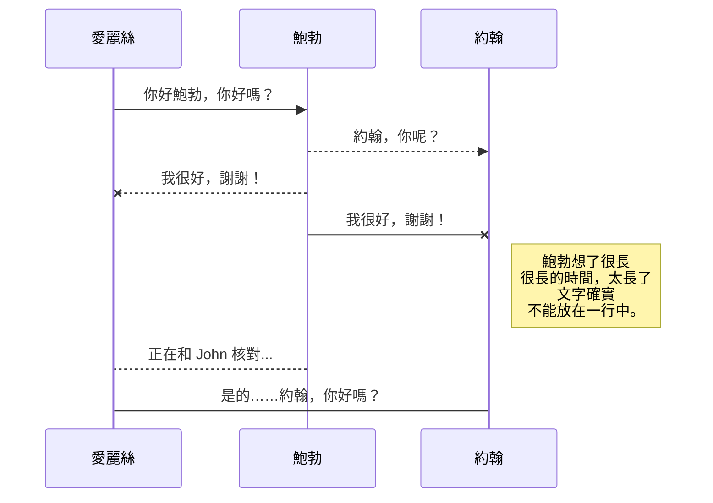
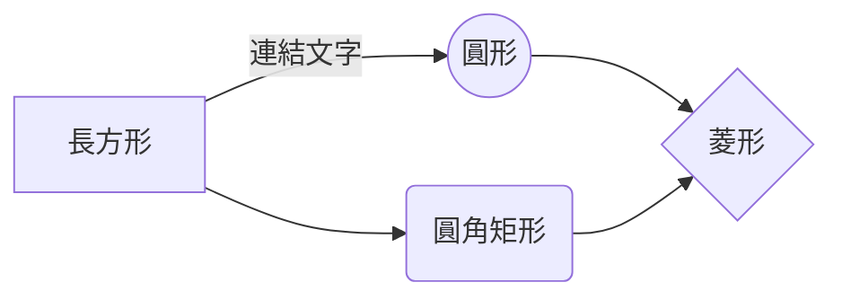

# 歡迎來到 GitPen！

你好！我是你在 **GitPen** 中的第一個 Markdown 檔案。如果你想了解 GitPen，可以閱讀此文章。如果你想玩 Markdown，你也可以編輯此文章。另外，您可以透過打開導覽列左邊的**檔案總管**來建立新檔案。

# 檔案

GitPen 將您的檔案儲存在您的瀏覽器中，這意味著您的所有檔案都會自動儲存在本機並且可以**離線存取！**

## 建立檔案和資料夾

使用導覽列左邊的資料夾圖示可以存取檔案總管。您可以透過點擊檔案總管中的**建立檔案**圖示來建立新檔案。您還可以透過點擊**建立資料夾**圖示來建立資料夾。

## 切換到另一個檔案

您的所有檔案和資料夾在檔案總管中都顯示為樹狀結構。您可以透過點擊樹狀結構中的檔案從一個檔案切換到另一個檔案。

## 重新命名檔案

您可以透過點擊導覽列中的檔案名稱或點擊檔案總管中的**重新命名**圖示來重新命名目前檔案。

## 搜尋檔案

您可以透過點擊檔案總管中的**搜尋檔案**圖示來透過關鍵字在整個文件空間中搜尋檔案。

## 刪除檔案

您可以透過點擊檔案總管中的**刪除**圖示來刪除目前檔案。該檔案將被移至**資源回收筒**資料夾並在 7 天不活動後自動刪除。

## 匯出檔案

您可以透過點擊選單中的**匯入/匯出**來匯出目前檔案。您可以選擇將檔案匯出為純 Markdown、使用 Handlebars 範本的 HTML 或 PDF。

# 同步

同步是 GitPen 的最大特點之一。它使您可以將文件空間中的任何檔案與儲存在 **Gitee** 和 **GitHub** 帳號中的其他檔案同步。這使您可以繼續在其他裝置上寫作，與您共享檔案的人協作，輕鬆整合到您的工作流程中......同步機制在背景每分鐘觸發一次，下載、合併和上傳檔案修改。

有兩種類型的同步，它們可以相互補充：

- 文件空間同步將自動同步您的所有檔案、資料夾和設定。這將允許您在任何其他裝置上取得您的文件空間。
> 要開始同步您的文件空間，只需在選單中使用 Gitee 登入。

- 檔案同步將保持文件空間的一個檔案與 **Gitee** 或 **GitHub** 中的一個或多個檔案同步。
> 在開始同步檔案之前，您必須在**同步**子選單中連結一個帳號。

## 開啟檔案

您可以透過開啟**同步**子選單並點擊**從...開啟**從 **Gitee** 或 **GitHub** 開啟檔案。在文件空間中開啟後，檔案中的任何修改都將自動同步。

## 儲存檔案

您可以透過開啟**同步**子選單並點擊**儲存到...**將文件空間的任何檔案儲存到 **Gitee** 或 **GitHub**。即使文件空間中的檔案已經同步，您也可以將其儲存到另一個位置。GitPen 可以將一個檔案與多個位置和帳號同步。

## 同步檔案

一旦您的檔案連結到同步位置，GitPen 將透過下載/上傳任何修改來定期同步它。如有必要，將執行合併並解決衝突。

如果您剛剛修改了檔案並且想要強制同步，請點擊導覽列中的**立即同步**按鈕。

> **注意：** 如果您沒有要同步的檔案，**立即同步**按鈕將被停用。

## 管理檔案同步

由於一個檔案可以與多個位置同步，您可以透過點擊**同步**子選單中的**檔案同步**列出和管理同步位置。這允許您列出和刪除連結到您的檔案的同步位置。

# 發佈

在 GitPen 中發佈使您可以輕鬆地在線上發佈檔案。對檔案感到滿意後，您可以將其發佈到不同的託管平台，例如 **Blogger**、**Gitee**、**Gist**、**GitHub**、**WordPress** 和 **Zendesk**。使用 [Handlebars 範本](http://handlebarsjs.com/)，您可以完全控制匯出的內容。

> 在開始發佈之前，您必須在**發佈**子選單中連結一個帳號。

## 發佈檔案

您可以透過開啟**發佈**子選單並點擊**發佈到**來發佈您的檔案。對於某些位置，您可以選擇以下格式：

- Markdown：在可以解釋的網站上發佈 Markdown 文字（例如 **GitHub**），
- HTML：透過 Handlebars 範本發佈轉換為 HTML 的檔案（例如在部落格上）。

## 更新發佈

發佈後，GitPen 會將您的檔案連結到該發佈，這使您可以輕鬆地重新發佈它。一旦您修改了檔案並想要更新您的發佈，請點擊導覽列中的**立即發佈**按鈕。

> **注意：** 如果您沒有要發佈的檔案，**立即發佈**按鈕將被停用。

## 管理檔案發佈

由於一個檔案可以發佈到多個位置，您可以透過點擊**發佈**子選單中的**檔案發佈**列出和管理發佈位置。這允許您列出和刪除連結到您的檔案的發佈位置。

# Markdown 擴充功能

GitPen 透過新增額外的 **Markdown 擴充功能**擴展了標準 Markdown 語法，為您提供了一些不錯的功能。

> **提示：** 您可以在**檔案屬性**對話框中停用任何 **Markdown 擴充功能**。

## SmartyPants

SmartyPants 將 ASCII 標點字元轉換為「智慧」印刷標點 HTML 實體。例如：

|                  |ASCII                          |HTML                         |
|------------------|-------------------------------|-----------------------------|
|單引號            |`'這不好玩嗎？'`               |'這不好玩嗎？'               |
|引用              |`"這不好玩嗎？"`               |"這不好玩嗎？"               |
|破折號            |`-- 是短破折號，--- 是長破折號`|-- 是短破折號，--- 是長破折號|

## KaTeX

您可以使用 [KaTeX](https://khan.github.io/KaTeX/) 渲染 LaTeX 數學表達式：

滿足 $\Gamma(n) = (n-1)!\quad\forall n\in\mathbb N$ 的 *Gamma 函數* 是透過歐拉積分

$
\Gamma(z) = \int_0^\infty t^{z-1}e^{-t}dt\,.
$

> 您可以在[這裡](http://meta.math.stackexchange.com/questions/5020/mathjax-basic-tutorial-and-quick-reference)找到有關 **LaTeX** 數學表達式的更多資訊。

## UML 圖

您可以使用 [Mermaid](https://mermaidjs.github.io/) 渲染 UML 圖。例如，這將產生一個序列圖：

這將產生一個流程圖：

